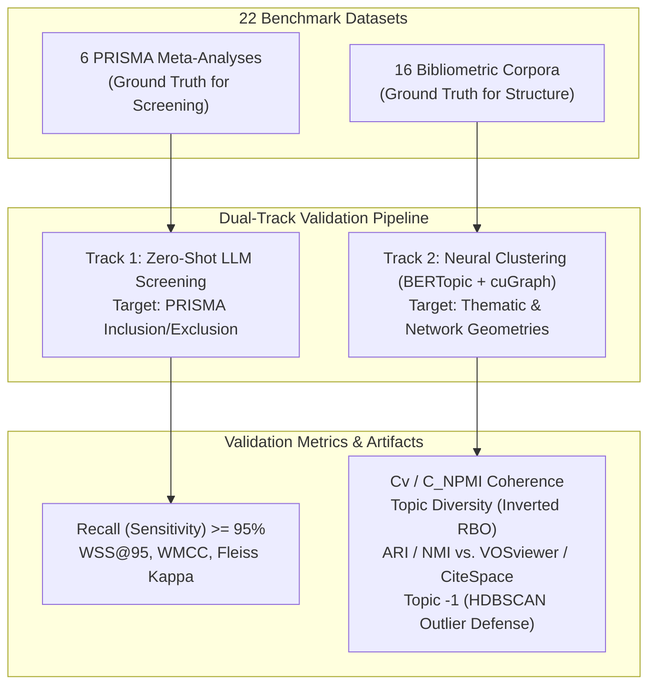
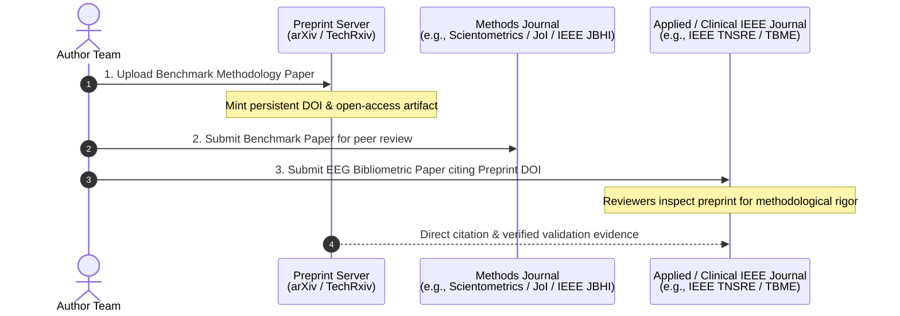

# Methodological Benchmark Validation Plan & Publishing Roadmap

## 1. Study Overview & Dataset Architecture
The benchmark paper evaluates the end-to-end automated bibliometric and systematic literature review (SLR) pipeline across a testbed of **22 published benchmark datasets** (6 PRISMA meta-analyses and 16 bibliometric mapping corpora).



---

## 2. Part 1: Validating LLM Screening (6 PRISMA Meta-Analyses)

Meta-analyses enforce deterministic PRISMA flowcharts where authors transition from wide raw database pulls to human-verified "Included" corpora. This human consensus forms an immutable ground truth.

### Evaluation Metrics

| Metric | Formulation / Definition | Methodological Rationale |
| :--- | :--- | :--- |
| **Recall / Sensitivity** | $\frac{\text{TP}}{\text{TP} + \text{FN}}$ | Critical criterion: missing an eligible clinical trial or study compromises review validity. Target: $\ge 95\%$. |
| **Specificity / Precision** | $\text{Spec} = \frac{\text{TN}}{\text{TN} + \text{FP}}$, $\text{Prec} = \frac{\text{TP}}{\text{TP} + \text{FP}}$ | Measures noise suppression across large negative candidate pools. |
| **Work Saved over Sampling (WSS@95)** | $\text{WSS@95} = \frac{\text{TN} + \text{FN}}{N} - (1 - 0.95)$ | Standard SLR efficiency metric quantifying human screening effort eliminated while guaranteeing 95% retention. |
| **Weighted Matthews Correlation Coefficient (WMCC)** | Class-weighted correlation addressing extreme class imbalance | Corrects for severe skew ($>98\%$ negative rate) where standard accuracy and balanced F1 fail to reflect non-random screening. |
| **Prompt Stability (Fleiss' $\kappa$)** | Test-retest agreement across 3 independent deterministic passes ($T=0$) on $N=200$ stratified samples | Quantifies boundary stability and absence of stochastic hallucinations. |

---

## 3. Part 2: Validating BERTopic & Neural Clustering (16 Bibliometric Corpora)

Validates unsupervised thematic clustering against classical algorithms (e.g., Latent Dirichlet Allocation, VOSviewer modularity, CiteSpace).

### A. Internal Mathematical Quality (OCTIS Framework)
- **Topic Coherence ($C_v$ and $C_{\text{NPMI}}$)**: Evaluates semantic co-occurrence of top-N cluster terms within source document representations.
- **Topic Diversity (Inverted Rank-Biased Overlap)**: Quantifies vocabulary separation across topic distributions, confirming distinct thematic separation rather than redundant clusters.

### B. External Semantic Alignment (Human / Established Baseline Alignment)
- **Adjusted Rand Index (ARI) & Normalized Mutual Information (NMI)**: Evaluates clustering partition similarity between pipeline-derived clusters and published manual/VOSviewer themes, adjusting for chance.
- **The "Topic -1" Defense (HDBSCAN Outlier Isolation)**: Demonstrates that isolating unclassifiable or ambiguous literature into an outlier bin (`Topic -1`) prevents noisy boundary contamination inherent in forced-assignment models (e.g., standard LDA).

---

## 4. Manuscript Structure (Section 3: Validation Framework)

```markdown
3. Experimental Validation & Benchmark Results
   3.1 Validation of Inclusion/Exclusion (LLM Zero-Shot Screening)
       - Testbed: 6 PRISMA Meta-Analyses
       - Primary Screening Metrics: Recall (Sensitivity), Specificity, WSS@95
       - Imbalance & Chance Correction: Weighted Matthews Correlation Coefficient (WMCC)
       - Deterministic Stability: Triplicate zero-temperature Fleiss' Kappa
   3.2 Validation of Thematic Clustering (BERTopic & GPU Graph Partitioning)
       - Testbed: 16 Published Bibliometric Corpora
       - Internal Validity: Cv / C_NPMI Coherence and Inverted RBO Diversity
       - External Ground-Truth Alignment: ARI and NMI against published clusters
       - Noise Isolation Architecture: Outlier containment via HDBSCAN Topic -1
```

---

## 5. Strategic Publishing Roadmap



### Citation Anchor in Applied Paper
> *"The automated screening and neural clustering pipeline utilized in this study was previously validated across a benchmark suite of 16 bibliometric corpora and 6 systematic meta-analyses, achieving [X]% recall (WSS@95 = [Y]%) and [Z] clustering coherence [Preprint Citation]."*
