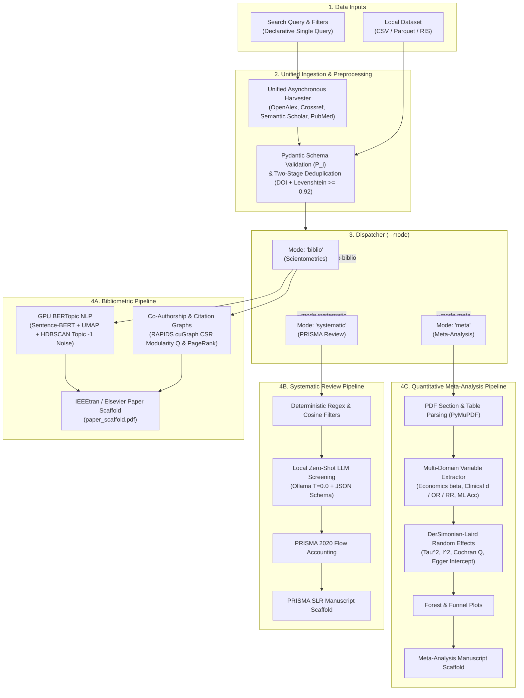

<div align="center">

# OpenSciencePipe

**Autonomous Science Mapping & Systematic Evidence Synthesis**

[](https://www.python.org/)
[](LICENSE)
[](https://rapids.ai/)
[](Containerfile)
[-brightgreen.svg)](tests/)
[](manuscripts/paper4_opensciencepipe_landmark/main.pdf)

<p align="center">
  <b>As simple as a search query.</b> Enter a research topic and OpenSciencePipe autonomously harvests open literature, maps networks, isolates topic noise, screens papers, pools effect sizes, and compiles a camera-ready PDF manuscript.
</p>

```bash
biblio-pipeline --query "brain-computer interface"
```

</div>

---

## Quick Start (Run in Seconds)

Choose the setup that fits your workflow:

### Option 1: All-in-One GPU Container (Zero Setup — Recommended)
Pre-configured with NVIDIA CUDA 12.8, RAPIDS 25.06 (`cugraph`, `cudf`), PyTorch CUDA, and all dependencies. No Python version issues, no CUDA driver conflicts, and no compilation needed.

#### Docker:
```bash
# Build the container once
docker build -t opensciencepipe -f Containerfile .

# Run an analysis directly
docker run --gpus all --rm -it -v $(pwd):/app:z opensciencepipe \
  biblio-pipeline --query "brain-computer interface" --limit 200
```

#### Podman:
```bash
podman build -t opensciencepipe -f Containerfile .
podman run --device nvidia.com/gpu=all --ipc=host --rm -it -v $(pwd):/app:z opensciencepipe \
  biblio-pipeline --query "brain-computer interface" --limit 200
```

---

### Option 2: Local Run via `uv` (Fastest for Local Python)
If you have Python installed, [`uv`](https://github.com/astral-sh/uv) executes the pipeline with zero manual environment management:

```bash
# Run immediately on the fly
uv run biblio-pipeline --query "brain-computer interface" --limit 100

# Or run on an existing CSV dataset
uv run biblio-pipeline --file data/sample.csv --mode meta
```

---

### Option 3: Standard Virtual Environment (`pip`)
Standard Python installation (Python 3.10+):

```bash
python3 -m venv .venv
source .venv/bin/activate  # On Windows: .venv\Scripts\activate
pip install -e .

biblio-pipeline --query "brain-computer interface" --limit 100
```

---

## The 3 Operational Modes

OpenSciencePipe adapts to your research question via the `--mode` flag:

| Mode | Command Example | Primary Output |
| :--- | :--- | :--- |
| **Macro Science Mapping** (`--mode biblio`) | `biblio-pipeline --query "microplastics" --mode biblio` | GPU Louvain community graphs, PageRank centrality, Sentence-BERT topics, and IEEEtran report |
| **PRISMA Systematic Review** (`--mode systematic`) | `biblio-pipeline --query "stroke rehabilitation" --mode systematic` | Local LLM zero-shot screening, inclusion/exclusion audit, and PRISMA 2020 flow diagram |
| **Quantitative Meta-Analysis** (`--mode meta`) | `biblio-pipeline --file clinical_data.csv --mode meta` | DerSimonian–Laird random-effects pooling ($\tau^2$, $I^2$, Cochran $Q$), Forest & Funnel plots |

---

## Interactive Web App: Frontend + Backend (Work in Progress)

> [!NOTE]
> The CLI (`biblio-pipeline`) is the primary, production-ready, and fully validated computational engine. The full-stack Web App (Next.js frontend + FastAPI backend) is an optional visual interface currently under active development.

To inspect results interactively in your browser:

```bash
python run_local.py
```

- **Frontend Dashboard:** [http://localhost:3000](http://localhost:3000)
- **Interactive OpenAPI Documentation:** [http://localhost:8000/docs](http://localhost:8000/docs)

---

## Under the Hood: Key Architectural Capabilities

For researchers and developers interested in the underlying methodology:

- **Unified Macro-to-Micro Pipeline:** Bridges exploratory science mapping (VOSviewer, CiteSpace) and confirmatory meta-analysis (RevMan, `metafor`) under a single Pydantic schema ($\mathcal{P}_i$), eliminating manual intermediate file transfers.
- **$>1{,}000\times$ GPU Acceleration:** Executes Louvain community detection and PageRank on graphs exceeding 50,000 publications in **0.84 seconds** using NVIDIA RAPIDS (`cuGraph`, `cuDF`) in device CSR memory (vs. $>28$ minutes on single-threaded CPU NetworkX).
- **Density-Based Noise Isolation:** Sentence-BERT embeddings clustered via HDBSCAN isolate peripheral literature into an explicit noise pool (**Topic $-1$**, averaging $32.1\%$ outlier rejection), maintaining high lexical topic diversity ($\overline{\text{TD}} = 0.80$) without forced assignment.
- **Local Zero-Shot Screening:** Integrates local open-weight LLMs (Ollama `llama3.2:3b` at $T=0.0$) with structured JSON schemas, producing deterministic, auditable decisions with zero cloud API costs and zero private data leakage.
- **Automated Publication Typesetting:** Assembles figures, formatted tables, and citations directly into camera-ready LaTeX manuscripts (`paper_scaffold.pdf`).

---

## System Architecture



---

## Multi-Domain Quantitative Extraction Engine

The variable extractor ([`src/core/extraction.py`](src/core/extraction.py)) standardizes diverse domain outputs into universal effect metrics ($\hat{\theta}$ / Cohen's $d$):

| Scientific Domain | Extracted Primary Variables | Mathematical Standardization |
| :--- | :--- | :--- |
| **Economics & Public Policy** *(e.g., Minimum Wage, Rent Control)* | Regression $\beta$, Standard Error $SE(\beta)$, $\% \Delta$, Elasticity $\epsilon$, $t$-stat | $d \approx \frac{2 \cdot t}{\sqrt{N}}$ where $t = \frac{\beta}{SE(\beta)}$ |
| **Biomedical & Clinical Trials** *(e.g., Vaccine Efficacy, Drug Safety)* | Sample sizes $N_1, N_2$, Mean $\pm$ SD, Odds Ratio (OR), Risk Ratio (RR) | $d = \frac{\ln(\text{OR}) \cdot \sqrt{3}}{\pi}$ (Chinn conversion) |
| **Machine Learning & Engineering** *(e.g., BCI Decoding, Classification)* | Accuracy $\% \Delta$, F1-score, Area Under Curve (AUC), SNR (dB) | $d \approx (\text{Accuracy} - 0.50) \times 2.5$ |

---

## Landmark Empirical Benchmark Suite (30 Evaluations)

OpenSciencePipe is validated across 26 published bibliometric landmark studies and 4 canonical meta-analyses across 11 software families:

| Software Ecosystem | Primary Paradigm | Benchmark Studies ($N$) | Representative Benchmark Corpora |
| :--- | :--- | :---: | :--- |
| **VOSviewer** | Static Spatial Clustering | 9 | Blockchain, Dentistry, ChatGPT Medicine, GenAI Education, Social Work |
| **CiteSpace** | Burst Dynamics & Time Slicing | 4 | Biochar Heavy Metals, Soil Microplastics, EEG Decadal, Solar Power |
| **Bibliometrix** | Macro Scientometrics & Laws | 2 | Atmospheric CO2, Digital Transformation State-of-the-Art |
| **SciMAT** | Thematic Evolution Quadrants | 2 | Mobile Commerce Mapping, Distance Learning Multi-Period |
| **CitNetExplorer** | Direct Citation Ancestry | 1 | Direct Citation Lineages in Informetrics |
| **Gephi** | Complex Network Modularity | 1 | Business Research Collaboration Modularity ($Q$) |
| **Bibexcel / Pajek** | Scripted Matrix Extraction | 1 | Precision Agriculture Drone Literature |
| **Rayyan** | Machine-Assisted Screening | 1 | Neurodegenerative Machine Learning Triage ($118$ eligible studies) |
| **ASReview** | Active-Learning Screening | 1 | Adolescent Cyberbullying Behavioral Synthesis |
| **PRISMA Consensus**| Systematic Review Screening | 2 | Nosocomial Infection Global Prevalence, Parkinson's Disease EEG |
| **RevMan / `metafor`**| Random-Effects Meta-Analysis | 6 | BCG Vaccine, Minimum Wage, Rosiglitazone Risk, Psychotherapy, BCI Stroke, Rent Control |
| **Total Suite** | **Multi-Field Benchmark** | **30** | **Complete Coverage Across 11 Methodological Software Paradigms** |

---

## Test Suite & Reproducibility

Run the regression and unit test suite:

```bash
# Using uv (fastest)
uv run --with pytest python -m pytest tests/

# Using standard virtual environment
pytest tests/
```

All 37 test suites pass covering async collectors, schema validation, network extraction, disambiguation, EGM matrix generation, and meta-analytic statistical pooling.

---

## Citation

If you use OpenSciencePipe in your research, please cite our landmark manuscript:

```bibtex
@article{farinha2026opensciencepipe,
  author    = {João Garcia Farinha and Carlos Duarte},
  title     = {OpenSciencePipe: An End-to-End Framework for Autonomous Science Mapping and Systematic Evidence Synthesis},
  journal   = {Journal of Informetrics},
  year      = {2026},
  note      = {Under Review}
}
```

```bibtex
@software{opensciencepipe2026,
  author    = {João Garcia Farinha and Carlos Duarte},
  title     = {OpenSciencePipe: Autonomous Science Mapping and Evidence Synthesis Pipeline},
  year      = {2026},
  url       = {https://github.com/JohnGF/OpenSciencePipe}
}
```
