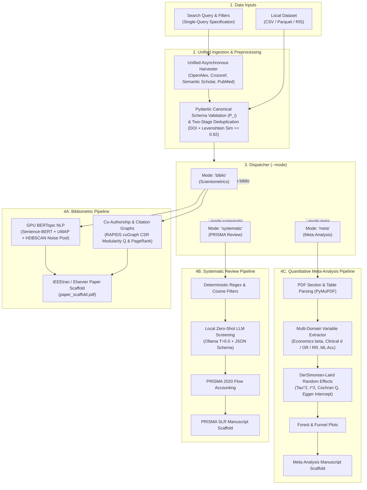

<div align="center">

# OpenSciencePipe

**An End-to-End Computational Framework for Autonomous Science Mapping and Systematic Evidence Synthesis**

[](https://www.python.org/)
[](LICENSE)
[](https://rapids.ai/)
[](Containerfile)
[-brightgreen.svg)](tests/)
[](manuscripts/paper4_opensciencepipe_landmark/main.pdf)

<p align="center">
  <b>As simple as a search query.</b> One declarative command executes multi-source harvesting, GPU-accelerated graph analytics, neural topic modeling, zero-shot LLM screening, random-effects meta-analysis, and camera-ready LaTeX manuscript compilation.
</p>

```bash
biblio-pipeline --query "brain-computer interface"
```

</div>

---

## Key Highlights

- **As Simple as a Search Query:** No multi-dialog GUI menus, no intermediate `.txt` flat-file transfers, and no spreadsheet copy-pasting. Enter a query and receive publication-grade vector figures, formatted LaTeX tables, and a compiled manuscript.
- **Unified Macro-to-Micro Synthesis:** Bridges the historical divide between macroscopic science mapping (VOSviewer, CiteSpace, Bibliometrix) and microscopic evidence synthesis (Cochrane RevMan, `metafor`, Rayyan, ASReview) under a shared Pydantic data schema.
- **$>1{,}000\times$ GPU Acceleration:** Executes Louvain community detection and PageRank on graphs exceeding 50,000 publications in **0.84 seconds** via NVIDIA RAPIDS (`cuGraph`, `cuDF`) in device CSR memory (vs. $>28$ minutes on CPU NetworkX).
- **Density-Based Noise Isolation:** Neural topic modeling (Sentence-BERT + UMAP + HDBSCAN) routes peripheral literature into an explicit noise pool (**Topic $-1$**, averaging $32.1\%$ outlier rejection), maintaining high lexical topic diversity ($\overline{\text{TD}} = 0.80$).
- **Local Zero-Shot Screening:** Integrates local open-weight LLMs (Ollama `llama3.2:3b` at $T=0.0$) with structured JSON schemas for auditable title/abstract PRISMA triage with zero cloud API costs and zero private data leakage.
- **Automated Publication Typesetting:** Autonomous compilation into camera-ready IEEEtran / Elsevier manuscripts (`paper_scaffold.pdf`) with synchronized figures, forest plots, funnel plots, and PRISMA flowcharts.

---

## Quick Start: Choose Your Deployment

Choose the setup that fits your environment:

### Option 1: All-in-One GPU Container (Recommended — Zero Local Setup)
Pre-configured with NVIDIA CUDA 12.8, RAPIDS 25.06 (`cugraph`, `cudf`), PyTorch CUDA, and all dependencies. No Python version mismatches, C++ compilation steps, or local CUDA driver conflicts.

#### Using Docker:
```bash
# 1. Build the all-in-one container
docker build -t opensciencepipe -f Containerfile .

# 2. Run an end-to-end pipeline analysis with GPU acceleration
docker run --gpus all --rm -it -v $(pwd):/app:z opensciencepipe \
  biblio-pipeline --query "brain-computer interface" --limit 200

# 3. Or launch the full-stack FastAPI backend
docker run --gpus all -p 8000:8000 -v $(pwd):/app:z opensciencepipe
```

#### Using Podman:
```bash
# Build & run directly with GPU passthrough
podman build -t opensciencepipe -f Containerfile .
podman run --device nvidia.com/gpu=all --ipc=host --rm -it -v $(pwd):/app:z opensciencepipe \
  biblio-pipeline --query "brain-computer interface" --limit 200
```

---

### Option 2: Ultra-Fast Local Run via `uv` (Recommended for Local Dev)
If you prefer running directly on your host machine, [`uv`](https://github.com/astral-sh/uv) handles environments and pinned dependencies instantly:

```bash
# 1. Install uv (if not already installed)
curl -LsSf https://astral.sh/uv/install.sh | sh

# 2. Run the pipeline immediately (uv resolves dependencies on the fly)
uv run biblio-pipeline --query "brain-computer interface" --limit 100

# Run on a local dataset
uv run biblio-pipeline --file data/collected_sample.csv --mode meta
```

---

### Option 3: Standard Python Virtual Environment (`pip`)
If you do not use `uv` or containers, standard `pip` works out of the box (Python 3.10+):

```bash
# 1. Create and activate virtual environment
python3 -m venv .venv
source .venv/bin/activate  # On Windows: .venv\Scripts\activate

# 2. Install OpenSciencePipe
pip install -e .

# 3. Run the CLI
biblio-pipeline --query "brain-computer interface" --limit 100
```

---

## Full-Stack Web GUI & Dashboard

For interactive visual exploration, launch the full-stack interface (FastAPI backend + Next.js frontend concurrently):

```bash
python run_local.py
```

- **Frontend Dashboard:** [http://localhost:3000](http://localhost:3000)
- **Interactive OpenAPI Documentation:** [http://localhost:8000/docs](http://localhost:8000/docs)

---

## Operational Modes

OpenSciencePipe supports three specialized analysis modes via the `--mode` flag:

### 1. Macro Science Mapping (`--mode biblio`)
Performs multi-source bibliographic harvesting, co-authorship community graphs, citation PageRank centrality, and BERTopic neural clustering:
```bash
biblio-pipeline --query "digital transformation" --mode biblio --start-year 2015 --end-year 2024 --limit 500 --output results_dt
```

### 2. PRISMA Systematic Review Screening (`--mode systematic`)
Applies PICOS inclusion/exclusion criteria, executes local zero-shot LLM screening via Ollama, builds taxonomic categories, and generates a PRISMA 2020 flow diagram:
```bash
biblio-pipeline --query "stroke neurorehabilitation" --mode systematic --limit 100 --output results_slr
```

### 3. Quantitative Meta-Analysis (`--mode meta`)
Extracts empirical effect sizes from study data, computes DerSimonian–Laird random-effects pooling ($\tau^2$, Cochran's $Q$, Higgins' $I^2$, Egger's test), and renders publication forest and funnel plots:
```bash
biblio-pipeline --file data/collected_sample.csv --mode meta --output results_meta
```

---

## System Architecture



---

## Multi-Domain Quantitative Extraction Engine

The variable extractor ([`src/core/extraction.py`](src/core/extraction.py)) standardizes diverse domain outputs into universal effect metrics ($\hat{\theta}$ / Cohen's $d$):

| Scientific Domain | Extracted Primary Variables | Mathematical Standardization |
| :--- | :--- | :--- |
| **Economics & Public Policy** *(e.g., Minimum Wage, Rent Control)* | Regression $\beta$, Standard Error $SE(\beta)$, $\% \Delta$, Elasticity $\epsilon$, $t$-stat | $d \approx \frac{2 \cdot t}{\sqrt{N}}$ where $t = \frac{\beta}{SE(\beta)}$ |
| **Biomedical & Clinical Trials** *(e.g., Vaccine Efficacy, Drug Safety)* | Sample sizes $N_1, N_2$, Mean $\pm$ SD, Odds Ratio (OR), Risk Ratio (RR) | $d = \frac{\ln(\text{OR}) \cdot \sqrt{3}}{\pi}$ (Chinn conversion) |
| **Machine Learning & Engineering** *(e.g., BCI Decoding, Classification)* | Accuracy $\% \Delta$, F1-score, Area Under Curve (AUC), SNR (dB) | $d \approx (\text{Accuracy} - 0.50) \times 2.5$ |

---

## Landmark Empirical Benchmark Suite (30 Evaluations)

OpenSciencePipe is evaluated against 26 published bibliometric landmark studies and 4 canonical meta-analyses across 11 software families:

| Software Ecosystem | Primary Paradigm | Benchmark Studies ($N$) | Representative Benchmark Corpora |
| :--- | :--- | :---: | :--- |
| **VOSviewer** | Static Spatial Clustering | 9 | Blockchain, Dentistry, ChatGPT Medicine, GenAI Education, Social Work |
| **CiteSpace** | Burst Dynamics & Time Slicing | 4 | Biochar Heavy Metals, Soil Microplastics, EEG Decadal, Solar Power |
| **Bibliometrix** | Macro Scientometrics & Laws | 2 | Atmospheric CO2, Digital Transformation State-of-the-Art |
| **SciMAT** | Thematic Evolution Quadrants | 2 | Mobile Commerce Mapping, Distance Learning Multi-Period |
| **CitNetExplorer** | Direct Citation Ancestry | 1 | Direct Citation Lineages in Informetrics |
| **Gephi** | Complex Network Modularity | 1 | Business Research Collaboration Modularity ($Q$) |
| **Bibexcel / Pajek** | Scripted Matrix Extraction | 1 | Precision Agriculture Drone Literature |
| **Rayyan** | Machine-Assisted Screening | 1 | Neurodegenerative Machine Learning Triage ($118$ eligible studies) |
| **ASReview** | Active-Learning Screening | 1 | Adolescent Cyberbullying Behavioral Synthesis |
| **PRISMA Consensus**| Systematic Review Screening | 2 | Nosocomial Infection Global Prevalence, Parkinson's Disease EEG |
| **RevMan / `metafor`**| Random-Effects Meta-Analysis | 6 | BCG Vaccine, Minimum Wage, Rosiglitazone Risk, Psychotherapy, BCI Stroke, Rent Control |
| **Total Suite** | **Multi-Field Benchmark** | **30** | **Complete Coverage Across 11 Methodological Software Paradigms** |

---

## Test Suite & Reproducibility

Execute the regression and unit test suite:

```bash
# Using uv (fastest)
uv run --with pytest python -m pytest tests/

# Using standard virtual environment
pytest tests/
```

All 37 test suites pass covering async collectors, schema validation, network extraction, disambiguation, EGM matrix generation, and meta-analytic statistical pooling.

---

## Citation

If you use OpenSciencePipe in your research, please cite our landmark manuscript:

```bibtex
@article{farinha2026opensciencepipe,
  author    = {João Garcia Farinha and Carlos Duarte},
  title     = {OpenSciencePipe: An End-to-End Framework for Autonomous Science Mapping and Systematic Evidence Synthesis},
  journal   = {Journal of Informetrics},
  year      = {2026},
  note      = {Under Review}
}
```

```bibtex
@software{opensciencepipe2026,
  author    = {João Garcia Farinha and Carlos Duarte},
  title     = {OpenSciencePipe: Autonomous Science Mapping and Evidence Synthesis Pipeline},
  year      = {2026},
  url       = {https://github.com/JohnGF/OpenSciencePipe}
}
```
